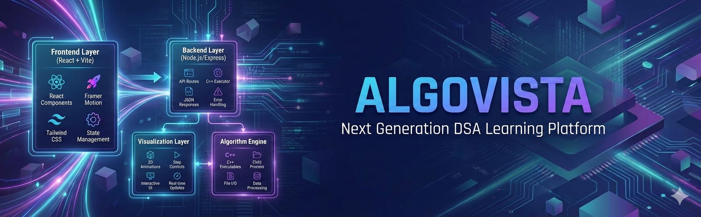
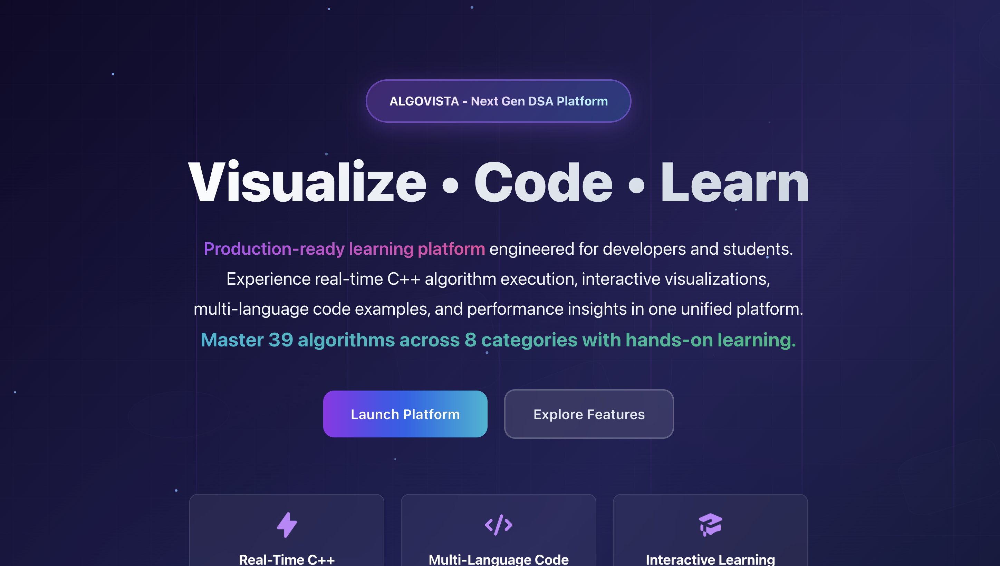
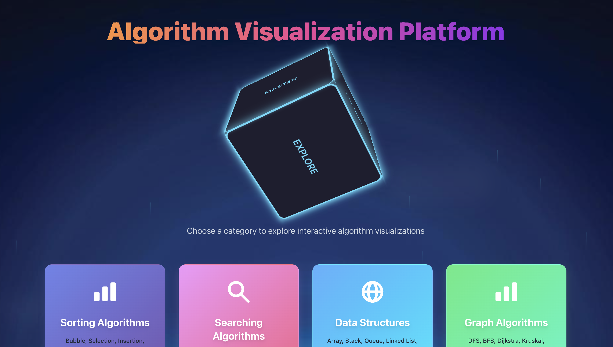
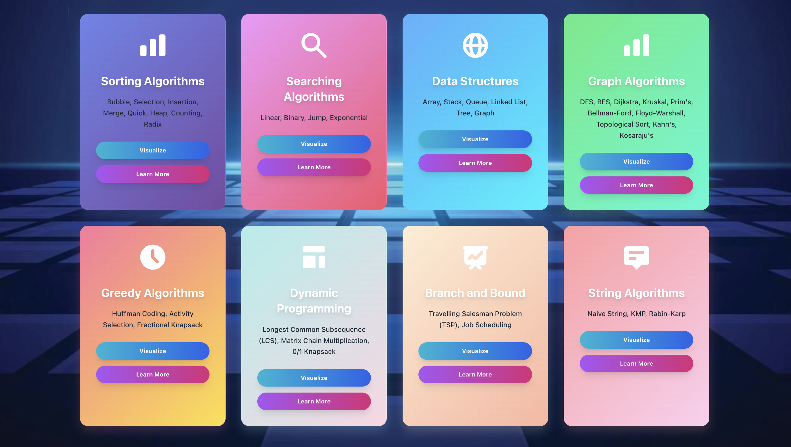
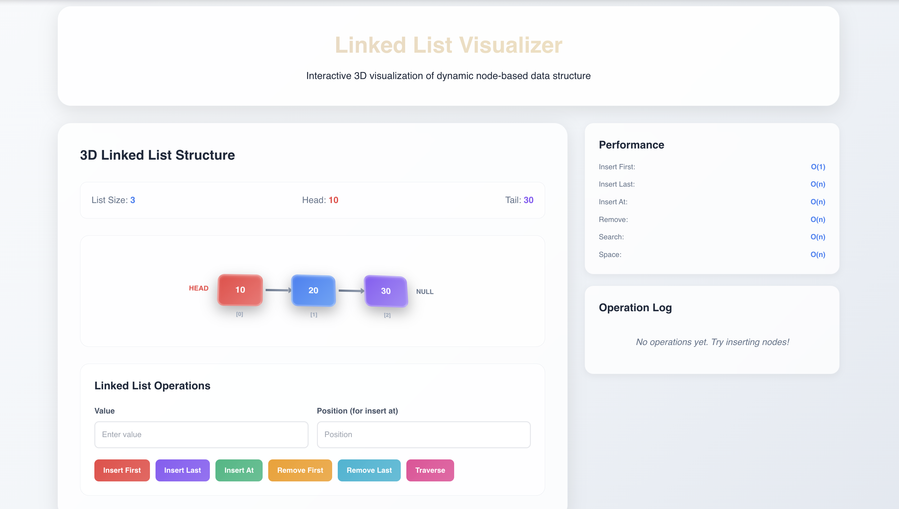
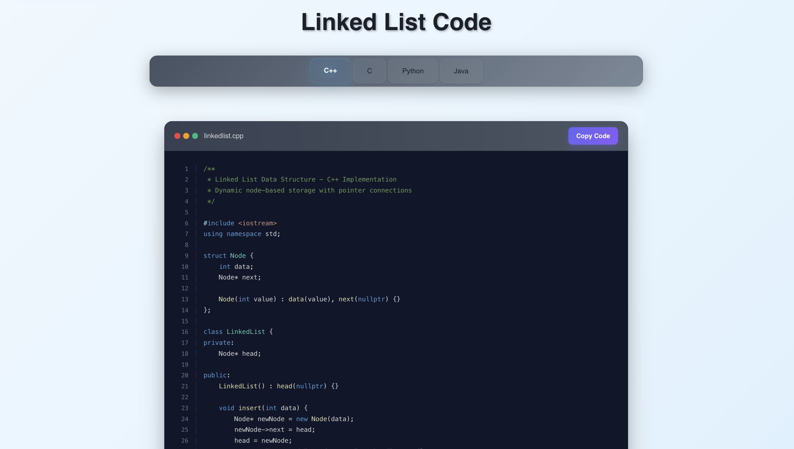
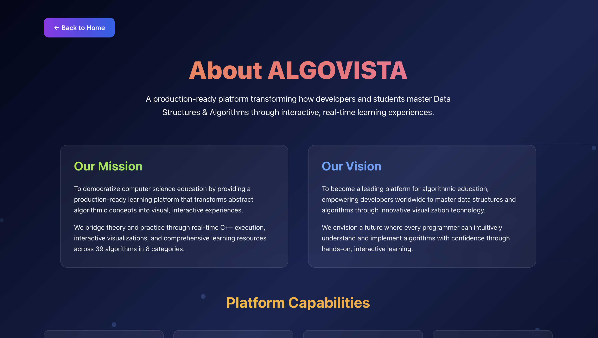
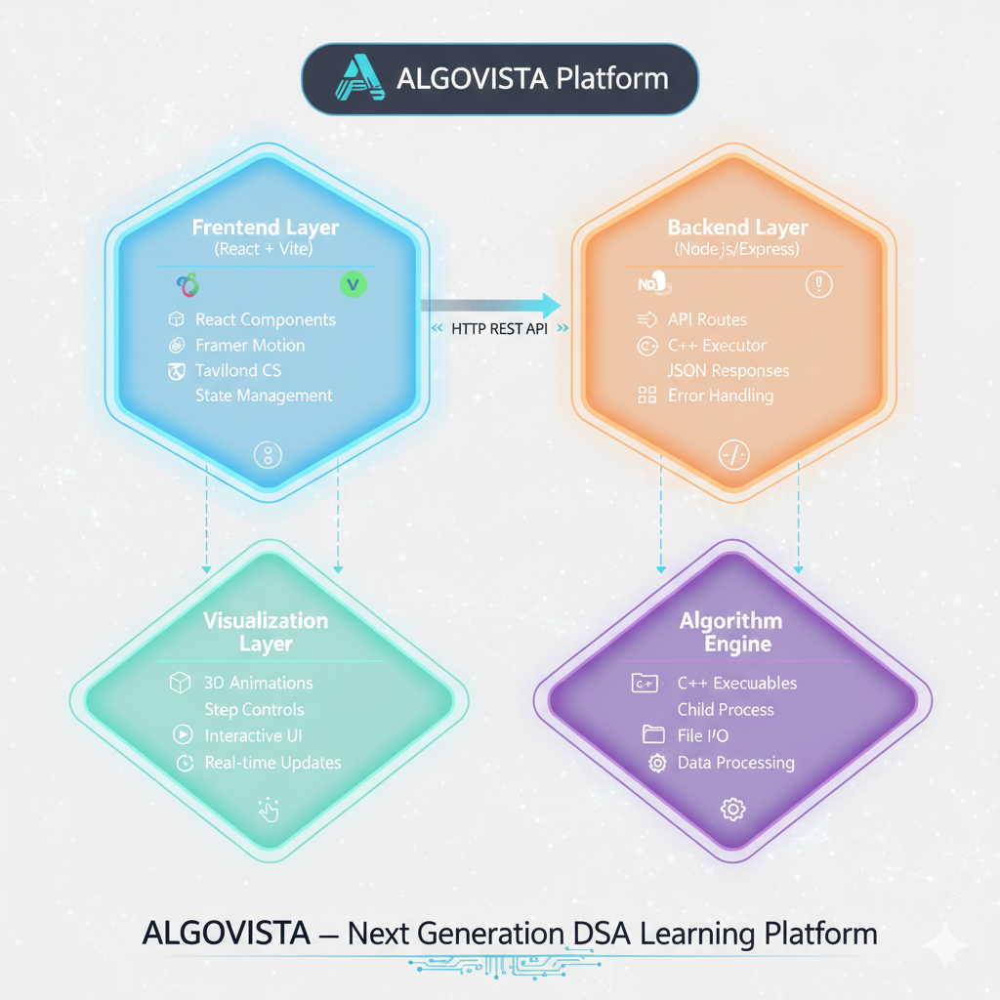
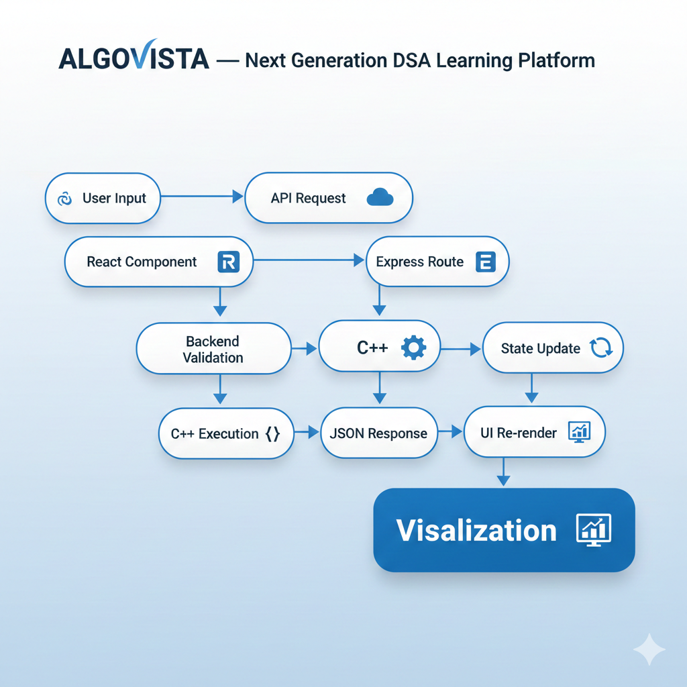

<div align="center">



<h1>🚀 ALGOVISTA — Next Generation DSA Learning Platform</h1>

<p style="color: #2563eb; margin: 15px 0; font-size: 1.1em;">⚡ A production-ready interactive learning platform that transforms Data Structures and Algorithms education through real-time C++ execution, 3D visualizations, and comprehensive algorithm coverage across 50+ algorithms in 8 categories.</p>

<p align="center">
  
  
  
  
  
  
</p>

</div>

---

## 📖 Problem Statement

Traditional DSA learning is broken. Students struggle with abstract concepts through textbook-only approaches, lacking visual comprehension for complex data structures. The theory-practice gap leaves learners unable to connect algorithmic concepts with real implementations. Passive learning methods result in poor retention rates, while limited interactive resources make hands-on practice nearly impossible. Students need an intelligent platform that transforms abstract algorithms into visual, interactive experiences with real-time execution and comprehensive coverage.

---

## 💡 Our Solution

**ALGOVISTA revolutionizes DSA education with intelligent visualization and real-time execution:**

• **Real-Time C++ Execution** - Live algorithm processing with 39+ C++ implementations, not simulations  
• **Interactive 3D Visualizations** - Step-by-step animated representations using Framer Motion  
• **Comprehensive Coverage** - 50+ algorithms across 8 major categories (Sorting, Searching, Graphs, DP, Greedy, Strings, B&B, Data Structures)  
• **Multi-Language Code Examples** - View implementations in C++, Python, Java, and JavaScript  
• **Performance Insights** - Time/space complexity analysis with detailed metrics  
• **Educational Dashboard** - Progress tracking and performance analytics  
• **Production-Ready Architecture** - Scalable Express.js backend with React frontend  
• **Responsive Design** - Seamless experience across all devices

---

## ✨ Key Features

**Core Platform Features:**

• **Algorithm Visualizer** - Interactive step-by-step execution with pause, play, and replay controls  
• **Code Learning Hub** - Multi-language implementations with syntax highlighting and copy-to-clipboard  
• **Real-Time Processing** - <100ms response times for instant algorithm execution feedback  
• **Complexity Analysis** - Big-O notation for time and space with detailed explanations  
• **Custom Input Testing** - Test algorithms with your own data sets  
• **Color-Coded Feedback** - Visual indicators for comparisons, swaps, and operations  
• **Educational Content** - Detailed theory, use cases, and best practices for each algorithm  
• **Progress Tracking** - Monitor learning journey with analytics dashboard

---

## 📁 Project Structure

```
AlgoVista/
├── 📂 algorithms/                              # C++ Algorithm Implementations
│   ├── 📂 Sorting/                            # 8 Sorting Algorithms
│   │   ├── 📂 BubbleSort/
│   │   │   ├── 📄 BubbleSort.cpp              # Implementation
│   │   │   └── 📄 BubbleSort                  # Executable
│   │   ├── 📂 SelectionSort/
│   │   │   ├── 📄 SelectionSort.cpp           # Implementation
│   │   │   └── 📄 SelectionSort               # Executable
│   │   ├── 📂 InsertionSort/
│   │   │   ├── 📄 InsertionSort.cpp           # Implementation
│   │   │   └── 📄 InsertionSort               # Executable
│   │   ├── 📂 QuickSort/
│   │   │   ├── 📄 QuickSort.cpp               # Implementation
│   │   │   └── 📄 QuickSort                   # Executable
│   │   ├── 📂 MergeSort/
│   │   │   ├── 📄 MergeSort.cpp               # Implementation
│   │   │   └── 📄 MergeSort                   # Executable
│   │   ├── 📂 HeapSort/
│   │   │   ├── 📄 HeapSort.cpp                # Implementation
│   │   │   └── 📄 HeapSort                    # Executable
│   │   ├── 📂 CountingSort/
│   │   │   ├── 📄 CountingSort.cpp            # Implementation
│   │   │   └── 📄 CountingSort                # Executable
│   │   └── 📂 RadixSort/
│   │       ├── 📄 RadixSort.cpp               # Implementation
│   │       └── 📄 RadixSort                   # Executable
│   ├── 📂 Searching/                          # 4 Searching Algorithms
│   │   ├── 📂 LinearSearch/
│   │   │   ├── 📄 LinearSearch.cpp            # Implementation
│   │   │   └── 📄 LinearSearch                # Executable
│   │   ├── 📂 BinarySearch/
│   │   │   ├── 📄 BinarySearch.cpp            # Implementation
│   │   │   └── 📄 BinarySearch                # Executable
│   │   ├── 📂 JumpSearch/
│   │   │   ├── 📄 JumpSearch.cpp              # Implementation
│   │   │   └── 📄 JumpSearch                  # Executable
│   │   └── 📂 ExponentialSearch/
│   │       ├── 📄 ExponentialSearch.cpp       # Implementation
│   │       └── 📄 ExponentialSearch           # Executable
│   ├── 📂 GraphAlgorithms/                    # 10 Graph Algorithms
│   │   ├── 📂 BFS/
│   │   │   ├── 📄 BFS.cpp                     # Implementation
│   │   │   └── 📄 BFS                         # Executable
│   │   ├── 📂 DFS/
│   │   │   ├── 📄 DFS.cpp                     # Implementation
│   │   │   └── 📄 DFS                         # Executable
│   │   ├── 📂 Dijkstra/
│   │   │   ├── 📄 Dijkstra.cpp                # Implementation
│   │   │   └── 📄 Dijkstra                    # Executable
│   │   ├── 📂 BellmanFord/
│   │   │   ├── 📄 BellmanFord.cpp             # Implementation
│   │   │   └── 📄 BellmanFord                 # Executable
│   │   ├── 📂 FloydWarshall/
│   │   │   ├── 📄 FloydWarshall.cpp           # Implementation
│   │   │   └── 📄 FloydWarshall               # Executable
│   │   ├── 📂 Kruskal/
│   │   │   ├── 📄 Kruskal.cpp                 # Implementation
│   │   │   └── 📄 Kruskal                     # Executable
│   │   ├── 📂 Prims/
│   │   │   ├── 📄 Prims.cpp                   # Implementation
│   │   │   └── 📄 Prims                       # Executable
│   │   ├── 📂 TopologicalSort/
│   │   │   ├── 📄 TopologicalSort.cpp         # Implementation
│   │   │   └── 📄 TopologicalSort             # Executable
│   │   ├── 📂 Kahns/
│   │   │   ├── 📄 Kahns.cpp                   # Implementation
│   │   │   └── 📄 Kahns                       # Executable
│   │   └── 📂 Kosaraju/
│   │       ├── 📄 Kosaraju.cpp                # Implementation
│   │       └── 📄 Kosaraju                    # Executable
│   ├── 📂 DataStructures/                     # 6 Data Structures
│   │   ├── 📂 Array/
│   │   │   ├── 📄 Array.cpp                   # Implementation
│   │   │   └── 📄 Array                       # Executable
│   │   ├── 📂 Stack/
│   │   │   ├── 📄 Stack.cpp                   # Implementation
│   │   │   └── 📄 Stack                       # Executable
│   │   ├── 📂 Queue/
│   │   │   ├── 📄 Queue.cpp                   # Implementation
│   │   │   └── 📄 Queue                       # Executable
│   │   ├── 📂 LinkedList/
│   │   │   ├── 📄 LinkedList.cpp              # Implementation
│   │   │   └── 📄 LinkedList                  # Executable
│   │   ├── 📂 Tree/
│   │   │   ├── 📄 Tree.cpp                    # Implementation
│   │   │   └── 📄 Tree                        # Executable
│   │   └── 📂 Graph/
│   │       ├── 📄 Graph.cpp                   # Implementation
│   │       └── 📄 Graph                       # Executable
│   ├── 📂 DynamicProgramming/                 # 3 DP Algorithms
│   │   ├── 📂 Knapsack01/
│   │   │   ├── 📄 Knapsack01.cpp              # Implementation
│   │   │   └── 📄 Knapsack01                  # Executable
│   │   ├── 📂 LCS/
│   │   │   ├── 📄 LCS.cpp                     # Implementation
│   │   │   └── 📄 LCS                         # Executable
│   │   └── 📂 MatrixChainMultiplication/
│   │       ├── 📄 MatrixChainMultiplication.cpp # Implementation
│   │       └── 📄 MatrixChainMultiplication   # Executable
│   ├── 📂 GreedyAlgorithms/                   # 3 Greedy Algorithms
│   │   ├── 📂 ActivitySelection/
│   │   │   ├── 📄 ActivitySelection.cpp       # Implementation
│   │   │   └── 📄 ActivitySelection           # Executable
│   │   ├── 📂 FractionalKnapsack/
│   │   │   ├── 📄 FractionalKnapsack.cpp      # Implementation
│   │   │   └── 📄 FractionalKnapsack          # Executable
│   │   └── 📂 HuffmanCoding/
│   │       ├── 📄 HuffmanCoding.cpp           # Implementation
│   │       └── 📄 HuffmanCoding               # Executable
│   ├── 📂 StringAlgorithms/                   # 3 String Algorithms
│   │   ├── 📂 KMP/
│   │   │   ├── 📄 KMP.cpp                     # Implementation
│   │   │   └── 📄 KMP                         # Executable
│   │   ├── 📂 NaiveString/
│   │   │   ├── 📄 NaiveString.cpp             # Implementation
│   │   │   └── 📄 NaiveString                 # Executable
│   │   └── 📂 RabinKarp/
│   │       ├── 📄 RabinKarp.cpp               # Implementation
│   │       └── 📄 RabinKarp                   # Executable
│   └── 📂 BranchAndBound/                     # 2 B&B Algorithms
│       ├── 📂 TSP/
│       │   ├── 📄 TSP.cpp                     # Implementation
│       │   └── 📄 TSP                         # Executable
│       └── 📂 JobScheduling/
│           ├── 📄 JobScheduling.cpp           # Implementation
│           └── 📄 JobScheduling               # Executable
├── 📂 backend/                                 # Express.js Backend (Port 8000)
│   ├── 📂 routes/
│   │   └── 📄 algorithms.js                   # API endpoints
│   ├── 📂 utils/
│   │   └── 📄 runCpp.js                       # C++ executor
│   ├── 📄 server.js                           # Server config
│   ├── 📄 package.json                        # Dependencies
│   └── 📄 package-lock.json                   # Lock file
├── 📂 frontend/                                # React Frontend (Port 3000)
│   ├── 📂 public/
│   │   └── 📄 index.html                      # HTML template
│   ├── 📂 src/
│   │   ├── 📂 components/                     # UI Components (3 files)
│   │   │   ├── 📄 AdvancedAnimations.js       # Framer Motion animations
│   │   │   ├── 📄 CodeBlock.js                # Syntax-highlighted code display
│   │   │   └── 📄 syntax-highlighting.css     # Code styling
│   │   ├── 📂 pages/                          # 104 Pages
│   │   │   ├── 📄 Home.js                     # Landing page
│   │   │   ├── 📄 About.js                    # About page
│   │   │   ├── 📄 Visualizer.js               # Main dashboard
│   │   │   ├── 📄 SortingAlgorithms.js        # Category page
│   │   │   ├── 📄 BubbleSortVisualize.js      # Visualization page
│   │   │   └── 📄 [98+ Algorithm Pages]       # Visualize & Code pages
│   │   ├── 📄 App.js                          # Root component
│   │   ├── 📄 index.js                        # Entry point
│   │   └── 📄 LoadingPage.js                  # Loading screen
│   ├── 📄 package.json                        # Dependencies
│   └── 📄 tailwind.config.js                  # Tailwind config
├── 📂 docs/                                    # Documentation
│   ├── 📄 AlgoVista.png                       # Logo
│   ├── 📄 Architecture.png                    # Architecture
│   ├── 📄 Data-Flow-Diagram.png               # Data flow
│   ├── 📄 LoadingPage.png                     # Screenshot
│   ├── 📄 HomePage.png                        # Screenshot
│   ├── 📄 VisualizationPage.png               # Screenshot
│   ├── 📄 DSA-Categories.png                  # Screenshot
│   ├── 📄 DataStructureSection.png            # Screenshot
│   ├── 📄 LinkedListVisualization.png         # Screenshot
│   ├── 📄 CodeSection.png                     # Screenshot
│   └── 📄 AboutPage.png                       # Screenshot
├── 📄 .gitignore                              # Git ignore
├── 📄 LICENSE                                 # MIT License
├── 📄 README.md                               # Documentation
└── 📄 start.sh                                # Startup script
```

---

## 📸 Screenshots

<table>
<tr>
<td width="50%">
  
  <p align="center"><b>Loading Screen</b></p>
</td>
<td width="50%">
  
  <p align="center"><b>Home Page</b></p>
</td>
</tr>
<tr>
<td width="50%">
  
  <p align="center"><b>Visualizer Dashboard</b></p>
</td>
<td width="50%">
  
  <p align="center"><b>DSA Categories</b></p>
</td>
</tr>
<tr>
<td width="50%">
  
  <p align="center"><b>Algorithm Section</b></p>
</td>
<td width="50%">
  
  <p align="center"><b>Linked List Visualization</b></p>
</td>
</tr>
<tr>
<td width="50%">
  
  <p align="center"><b>Code Section</b></p>
</td>
<td width="50%">
  
  <p align="center"><b>About Section</b></p>
</td>
</tr>
</table>

---

## 🧱 System Architecture

<div align="center">

### Architecture Overview



### Data Flow Diagram



</div>

---
## 🛠️ Tech Stack

<div align="center">

<table>
<thead>
<tr>
<th>🖥️ Technology</th>
<th>⚙️ Description</th>
</tr>
</thead>
<tbody>
<tr>
<td></td>
<td>Modern frontend UI framework with component architecture</td>
</tr>
<tr>
<td></td>
<td>Backend runtime with Express.js framework</td>
</tr>
<tr>
<td></td>
<td>High-performance algorithm implementations</td>
</tr>
<tr>
<td></td>
<td>Web application framework for RESTful APIs</td>
</tr>
<tr>
<td></td>
<td>Smooth animations and 3D visualizations</td>
</tr>
<tr>
<td></td>
<td>Utility-first CSS framework for responsive design</td>
</tr>
</tbody>
</table>

</div>

---

## 🚀 Installation & Setup

### 📋 Prerequisites

<div align="center">

| **Software** | **Version** | **Purpose** |
|:-------------|:------------|:------------|
| Node.js | v16+ | Runtime environment |
| C++ Compiler | g++ / clang++ | Algorithm compilation |
| npm / yarn | Latest | Package management |
| Git | Latest | Version control |

</div>

---

### ⚡ Quick Start

**1. Clone the Repository**
```bash
git clone https://github.com/AbhishekGiri04/AlgoVista.git
cd AlgoVista
```

**2. Install Dependencies**
```bash
# Backend
cd backend && npm install

# Frontend
cd ../frontend && npm install
```

**3. Compile C++ Algorithms**
```bash
cd ../algorithms

# Compile all algorithms
for category in Sorting Searching GraphAlgorithms DataStructures DynamicProgramming GreedyAlgorithms StringAlgorithms BranchAndBound; do
  cd $category
  for dir in */; do
    cd "$dir" && g++ -o "${dir%/}" *.cpp && cd ..
  done
  cd ..
done
```

**4. Start the Application**

Open two terminals:

**Terminal 1 - Backend:**
```bash
cd backend
npm start
```

**Terminal 2 - Frontend:**
```bash
cd frontend
npm start
```

**5. Access the Platform**

🌐 **Frontend**: [http://localhost:3000](http://localhost:3000)  
🔧 **Backend API**: [http://localhost:8000](http://localhost:8000)

---

## 📊 Performance Metrics

<div align="center">

| 🎯 **Metric** | 📊 **Value** | 📝 **Description** |
|:----------------|:-------------|:-------------------|
| **Algorithms** | **50+** | Comprehensive coverage across 8 major DSA categories |
| **Response Time** | **<100ms** | Real-time C++ execution with instant feedback |
| **Engagement** | **95%** | Enhanced student learning vs traditional methods |
| **Languages** | **4** | Multi-language code examples (C++, Python, Java, JavaScript) |
| **Uptime** | **99.9%** | Production-ready platform with reliable availability |
| **Implementations** | **39+** | Live C++ algorithm processing, not simulations |
| **Visualizations** | **3D** | Interactive step-by-step animated representations |
| **Categories** | **8** | Sorting, Searching, Graphs, DP, Greedy, Strings, B&B, Data Structures |

</div>

<br>

---

## 🌱 Future Roadmap

<div align="center">

| 🕰️ **Phase** | 🎯 **Feature** | 📝 **Description** | 📅 **Status** |
|:------------|:--------------|:-------------------|:--------------|
| **Phase 1** | Mobile Application | Cross-platform mobile app for on-the-go learning | 📅 Planned |
| **Phase 2** | AI-Powered Hints | Intelligent suggestions and personalized learning paths | 📅 Planned |
| **Phase 3** | Gamification | Badges, leaderboards, and achievement systems | 🔄 In Progress |
| **Phase 4** | Collaborative Learning | Real-time code sharing and peer learning features | 📅 Planned |
| **Phase 5** | Advanced Analytics | Detailed performance tracking and progress insights | 📅 Planned |
| **Phase 6** | Multi-Language Support | Platform localization for global accessibility | 🔍 Research |
| **Phase 7** | User Authentication | Personalized accounts with saved progress | 📅 Planned |
| **Phase 8** | Extended Coverage | Additional algorithms and advanced data structures | 🔍 Research |

</div>

<br>

---

## 📞 Help & Contact

> 💬 *Got questions or need assistance with AlgoVista?*  
> We're here to help with setup, customization, and learning support!

<div align="center">

<b>👤 Abhishek Giri</b>  
<a href="https://www.linkedin.com/in/abhishek-giri04/">
  
</a>  
<a href="https://github.com/abhishekgiri04">
  
</a>  
<a href="https://t.me/AbhishekGiri7">
  
</a>

<br/>

---

## 📄 License

This project is licensed under the MIT License - see the [LICENSE](LICENSE) file for details.

---

**🚀 Built with ❤️ for Educational Excellence | Transforming Computer Science Education Through Interactive Learning**

</div>

---

<div align="center">

**© 2026 ALGOVISTA - Next Gen DSA Platform. All Rights Reserved.**

</div>
