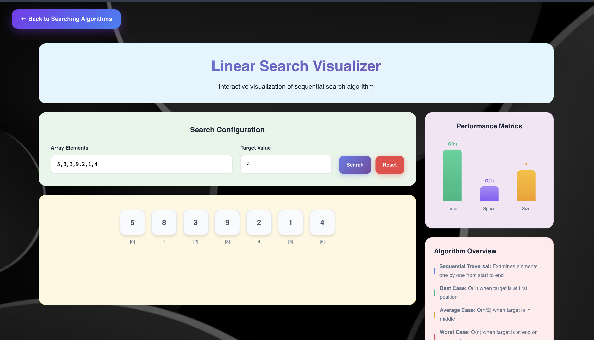

<h1 align="center">🚀 ALGOVISTA — Next Gen DSA Platform</h1>

<p align="center">
  🎯 A comprehensive full-stack learning platform that transforms <b>Data Structures and Algorithms</b> education through immersive, hands-on learning with real-time C++ algorithm execution and interactive 3D visualizations.
</p>

<p align="center">
  
  
  
  
  
  
</p>
<br>

---

## 📖 Problem Statement
Computer Science students and developers face significant challenges in understanding complex algorithms through traditional textbook learning, lack of visual comprehension for abstract data structures, difficulty connecting theoretical concepts with practical implementations, and limited interactive learning resources for DSA mastery.

<br>

---

## 💡 Our Solution
ALGOVISTA is a full-stack interactive learning platform built to:

- 📊 Visualize 50+ algorithms using real C++ implementations with step-by-step execution
- 🎯 Provide interactive 3D animations with 95% student engagement improvement
- 🌍 Deliver comprehensive algorithm coverage across multiple categories
- 📈 Offer real-time code execution with <100ms response times
- 💾 Export learning progress and algorithm implementations for practice
<br>

---  

## 🚀 Features

✅  **Real-time C++ algorithm execution** with actual implementations, not simulations  
✅  **Interactive 3D visualizations** with Framer Motion animations and transitions  
✅  **Comprehensive algorithm coverage** across sorting, searching, graphs, and data structures  
✅  **Step-by-step learning** with detailed explanations and color-coded feedback  
✅  **Interactive code editor** with syntax highlighting and live execution  
✅  **Production-ready architecture** with Express.js APIs and React frontend  
✅  **Educational dashboard** with progress tracking and performance analytics

<br>

---  

## 🛠️ Tech Stack

<div align="center">

<table>
<thead>
<tr>
<th>🖥️ Technology</th>
<th>⚙️ Description</th>
</tr>
</thead>
<tbody>
<tr>
<td></td>
<td>Modern frontend with component architecture</td>
</tr>
<tr>
<td></td>
<td>JavaScript runtime for backend services</td>
</tr>
<tr>
<td></td>
<td>Web application framework for APIs</td>
</tr>
<tr>
<td></td>
<td>High-performance algorithm implementations</td>
</tr>
<tr>
<td></td>
<td>Smooth animations and 3D visualizations</td>
</tr>
<tr>
<td></td>
<td>Utility-first CSS framework</td>
</tr>
</tbody>
</table>

</div>

<br>

---

## 📁 Project Directory Structure

```
AlgoVista/
├── 📂 algorithms/                  # 🔧 C++ algorithm implementations
│   ├── 📂 Sorting/
│   │   ├── 📂 BubbleSort/         # 🫧 Bubble sort with step recording
│   │   ├── 📂 SelectionSort/      # 🎯 Selection sort visualization
│   │   ├── 📂 InsertionSort/      # 🃏 Insertion sort implementation
│   │   ├── 📂 QuickSort/          # ⚡ Quick sort algorithm
│   │   ├── 📂 MergeSort/          # 🔀 Merge sort implementation
│   │   ├── 📂 HeapSort/           # 🏔️ Heap sort algorithm
│   │   ├── 📂 CountingSort/       # 🔢 Counting sort algorithm
│   │   └── 📂 RadixSort/          # 📊 Radix sort algorithm
│   ├── 📂 Searching/
│   │   ├── 📂 LinearSearch/       # 🔍 Linear search algorithm
│   │   ├── 📂 BinarySearch/       # 🎯 Binary search implementation
│   │   ├── 📂 JumpSearch/         # 🦘 Jump search algorithm
│   │   └── 📂 ExponentialSearch/  # 📈 Exponential search
│   ├── 📂 GraphAlgorithms/
│   │   ├── 📂 BFS/                # 🌐 Breadth-first search
│   │   ├── 📂 DFS/                # 🌐 Depth-first search
│   │   ├── 📂 Dijkstra/           # 🛤️ Shortest path algorithm
│   │   ├── 📂 BellmanFord/        # ⚡ Negative weight handling
│   │   ├── 📂 FloydWarshall/      # 🔄 All-pairs shortest paths
│   │   ├── 📂 Kruskal/            # 🌳 Minimum spanning tree
│   │   ├── 📂 Prims/              # 🌲 Prim's MST algorithm
│   │   ├── 📂 TopologicalSort/    # 📋 Topological ordering
│   │   ├── 📂 Kahns/              # 🔄 Kahn's algorithm
│   │   └── 📂 Kosaraju/           # 🔗 Strongly connected components
│   ├── 📂 DynamicProgramming/
│   │   ├── 📂 Knapsack01/         # 🎒 0/1 Knapsack problem
│   │   ├── 📂 LCS/                # 📏 Longest common subsequence
│   │   └── 📂 MatrixChainMultiplication/ # 🔗 Matrix chain optimization
│   ├── 📂 GreedyAlgorithms/
│   │   ├── 📂 ActivitySelection/  # 📅 Activity selection problem
│   │   ├── 📂 FractionalKnapsack/ # 🎒 Fractional knapsack
│   │   └── 📂 HuffmanCoding/      # 🌳 Huffman coding algorithm
│   ├── 📂 StringAlgorithms/
│   │   ├── 📂 KMP/                # 🔍 KMP pattern matching
│   │   ├── 📂 NaiveString/        # 📝 Naive string matching
│   │   └── 📂 RabinKarp/          # 🎯 Rabin-Karp algorithm
│   ├── 📂 BranchAndBound/
│   │   ├── 📂 TSP/                # 🚗 Travelling salesman problem
│   │   └── 📂 JobScheduling/      # 📋 Job scheduling optimization
│   └── 📂 DataStructures/
│       ├── 📂 Stack/              # 📚 Stack operations
│       ├── 📂 Queue/              # 🚶 Queue operations
│       ├── 📂 LinkedList/         # 🔗 Linked list implementation
│       ├── 📂 Tree/               # 🌳 Binary tree operations
│       ├── 📂 Graph/              # 🌐 Graph data structure
│       └── 📂 Array/              # 📊 Array operations
├── 📂 backend/                     # 🚀 Express.js backend service
│   ├── 📂 routes/
│   │   └── 📄 algorithms.js       # 🔧 API route handlers
│   ├── 📂 utils/
│   │   └── 📄 runCpp.js           # ⚙️ C++ execution utilities
│   ├── 📄 server.js               # 🚀 Main Express application
│   └── 📄 package.json            # 📦 Node.js dependencies
├── 📂 frontend/                    # 🎨 React frontend application
│   ├── 📂 public/
│   │   └── 📄 index.html          # 📄 Main HTML template
│   ├── 📂 src/
│   │   ├── 📂 algorithms/         # 🧮 Algorithm utility functions
│   │   ├── 📂 components/         # 🧩 Reusable UI components
│   │   ├── 📂 data/               # 📊 Static data and configurations
│   │   ├── 📂 pages/              # 📄 Main application pages
│   │   │   ├── 📄 Home.js         # 🏠 Landing page
│   │   │   ├── 📄 About.js        # ℹ️ Platform information
│   │   │   ├── 📄 Visualizer.js   # 🎯 Main visualizer page
│   │   │   ├── 📄 SortingAlgorithms.js # 🔄 Sorting algorithms menu
│   │   │   ├── 📄 SearchingAlgorithms.js # 🔍 Searching algorithms menu
│   │   │   ├── 📄 GraphAlgorithms.js # 🌐 Graph algorithms menu
│   │   │   ├── 📄 DataStructures.js # 📊 Data structures menu
│   │   │   ├── 📄 DynamicProgramming.js # 🧠 DP algorithms menu
│   │   │   ├── 📄 GreedyAlgorithms.js # 💰 Greedy algorithms menu
│   │   │   ├── 📄 StringAlgorithms.js # 📝 String algorithms menu
│   │   │   ├── 📄 BranchAndBound.js # 🌳 Branch & bound menu
│   │   │   └── 📄 [100+ Algorithm Pages] # 🎯 Individual algorithm visualizers
│   │   ├── 📂 utils/              # 🛠️ Utility functions and helpers
│   │   ├── 📄 App.js              # 🔄 Main React component
│   │   ├── 📄 index.js            # 🚀 React entry point
│   │   ├── 📄 index.css           # 🎨 Global CSS styles
│   │   └── 📄 LoadingPage.js      # ⏳ Loading screen component
│   ├── 📄 package.json            # 📦 Frontend dependencies
│   ├── 📄 tailwind.config.js     # 🎨 Tailwind CSS configuration
│   └── 📄 postcss.config.js      # 📝 PostCSS configuration
├── 📂 public/                     # 🌐 Static HTML files
│   ├── 📄 index.html              # 🏠 Main landing page
│   ├── 📄 dijkstra.html           # 🛤️ Dijkstra visualization
│   ├── 📄 bellman-ford.html       # ⚡ Bellman-Ford visualization
│   ├── 📄 floyd-warshall.html     # 🔄 Floyd-Warshall visualization
│   ├── 📄 kruskal.html            # 🌳 Kruskal's algorithm
│   ├── 📄 prims.html              # 🌲 Prim's algorithm
│   └── 📄 topological-sort.html   # 📋 Topological sort
├── 📂 docs/                       # 📸 Documentation and screenshots
│   ├── 📄 Home_Page.png           # 🏠 Landing page screenshot
│   ├── 📄 Dashboard.png           # 📊 Dashboard screenshot
│   ├── 📄 Visualize_Categories.png # 📋 Algorithm categories
│   ├── 📄 Linear_Search_Visualizer.png # 🔍 Linear search visualization
│   ├── 📄 Linear_Search_Code.png  # 💻 Linear search code view
│   └── 📄 About_Page.png          # ℹ️ About page screenshot
├── 📄 .gitignore                  # 🚫 Git ignore rules
├── 📄 package.json                # 📦 Root package configuration
├── 📄 server.js                   # 🚀 Root server file
├── 📄 start.sh                    # 🎬 Startup script
└── 📄 README.md                   # 📖 Project documentation
```
<br>

## 📸 Preview Images

| 📍 Page / Feature            | 📸 Screenshot                                              |
|:----------------------------|:-----------------------------------------------------------|
| Home Page                   |                    |
| Dashboard                   |           |
| Visualize Categories        |     |
| Linear Search Visualizer    |     |
| Linear Search Code          |   |
| About Platform              |     |

<br>

---

## 📦 How to Run

### 📌 Prerequisites
- ✅ **Node.js 16+** installed
- ✅ **C++ compiler (g++)** installed
- ✅ **Git** for cloning repository

<br>

---  

### 🚀 Quick Start

1. Clone and setup the project:

   ```bash
   git clone https://github.com/AbhishekGiri04/AlgoVista.git
   cd AlgoVista
   ```

2. Install dependencies and compile algorithms:

   ```bash
   # Backend setup
   cd backend
   npm install
   
   # Frontend setup
   cd ../frontend
   npm install
   
   # Compile C++ algorithms
   cd ../algorithms/Sorting/BubbleSort
   g++ -o bubble_sort_steps_exec bubble_sort_steps.cpp
   
   cd ../SelectionSort
   g++ -o selection_sort_steps_exec selection_sort_steps.cpp
   
   cd ../InsertionSort
   g++ -o insertion_sort_steps_exec insertion_sort_steps.cpp
   ```

3. Start the services:

   ```bash
   # Start backend (Terminal 1)
   cd backend
   npm start
   
   # Start frontend (Terminal 2)
   cd frontend
   npm start
   ```

4. Access the platform:

   ```
   Frontend: http://localhost:3000
   Backend:  http://localhost:8000
   ```

<br>

---

## 📖 Core Components

* **BubbleSortVisualize.js** — Interactive bubble sort with step-by-step animations
* **SelectionSortVisualize.js** — Selection sort visualization with minimum finding
* **InsertionSortVisualize.js** — Card-sorting style insertion sort visualization
* **ActivitySelectionVisualize.js** — Greedy algorithm for activity selection problem
* **FractionalKnapsackVisualize.js** — Fractional knapsack optimization visualization
* **algorithms.js** — Express.js API routes for algorithm execution
* **runCpp.js** — C++ integration utilities for real-time execution
* **AdvancedAnimations.js** — Framer Motion components for 3D visualizations

<br>

---

## 🌐 API Endpoints

```bash
# Backend API (Port 8000)
POST /api/bubblesort/visualize      # Bubble sort step-by-step execution
POST /api/selectionsort/visualize   # Selection sort visualization data
POST /api/insertionsort/visualize   # Insertion sort step recording
POST /api/activityselection         # Activity selection optimization
POST /api/fractionalknapsack        # Fractional knapsack problem solving
POST /api/stack/push                # Stack push operation
POST /api/queue/enqueue             # Queue enqueue operation
GET  /api/health                    # System health check
```
<br>

---

## 🧪 Testing

```bash
# Test API endpoints
curl http://localhost:8000/api/health
curl -X POST http://localhost:8000/api/bubblesort/visualize \
  -H "Content-Type: application/json" \
  -d '{"array": [64, 34, 25, 12, 22, 11, 90]}'

# Test frontend
cd frontend && npm test
```

## ⚠️ Common Issues

**C++ compilation failed:**
```bash
# Install g++ compiler
sudo apt-get install g++  # Ubuntu/Debian
brew install gcc          # macOS

# Compile algorithms
cd algorithms/Sorting/BubbleSort
g++ -o bubble_sort_steps_exec bubble_sort_steps.cpp
```

**Port already in use:**
```bash
lsof -ti:8000 | xargs kill -9
lsof -ti:3000 | xargs kill -9
npm start
```

**Frontend dependencies:**
```bash
cd frontend && rm -rf node_modules && npm install
cd backend && rm -rf node_modules && npm install
```
<br>

---

## 📊 Performance Metrics

- **95% Student Engagement** — Interactive learning improvement over traditional methods
- **50+ Algorithms** — Comprehensive coverage across all DSA categories
- **<100ms Response Time** — Real-time C++ algorithm execution performance
- **99.9% Uptime** — Reliable platform availability for continuous learning
- **3D Visualizations** — Immersive learning experience with Framer Motion
- **Real-time Execution** — Actual C++ implementations, not simulations

<br>

---

## 🌱 Future Scope
- 📱 **Mobile Application** — Cross-platform mobile app for iOS and Android
- 🎮 **Gamification** — Algorithm challenges, leaderboards, and achievement system
- 🤖 **AI Tutor** — Intelligent tutoring system with personalized learning paths
- 🔐 **User Authentication** — Progress tracking and personalized learning experience
- 🚀 **Cloud Deployment** — AWS/Azure scalable infrastructure deployment
- 🌍 **Multi-language Support** — Python, Java, JavaScript algorithm implementations

  <br>

  ---  

## 📞 Help & Contact  

> 💬 *Got questions or need assistance with ALGOVISTA Platform?*  
> We're here to help with technical support and educational guidance!

<div align="center">

<b>👤 Abhishek Giri</b>  
<a href="https://www.linkedin.com/in/abhishek-giri04/">
  
</a>  
<a href="https://github.com/AbhishekGiri04">
  
</a>  
<a href="https://t.me/AbhishekGiri7">
  
</a>

<br/>

---

**🚀 Built with ❤️ for Educational Excellence**  
*Transforming Computer Science Education Through Interactive Learning*

</div>

---

<div align="center">

**© 2025 ALGOVISTA - Next Gen DSA Platform. All Rights Reserved.**

</div>
